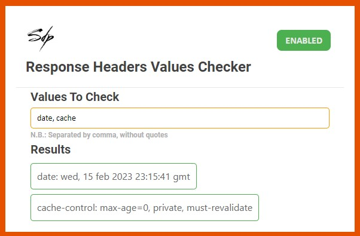

 

  

    <!---->
    <h1>Response Headers Values Checker</h1>
  </img>

## What is this?
This is a Chrome Extension. It's a very simple one: the extension will read the response of the current page and will show,
inside the extension popup, the value you will search for into the input (if exist).

For example: if you write "date" inside the input, inside the "Result" section you will see the value of "date"
readed from the header response.

All the values you will insert must be separated by comma (spaces are admitted, the words splitted by comma will be "trimmed" too). 
For example:
<pre>date, cache-control, dispatcher</pre>

In order to make the extension works correctly, refresh the page before trying to read the values.

N.B.: if you have a page that autorefresh somewhere, the value retrieved will be updated with the latest page refreshed.

## <i align="center">Screenshot</i>

## Chrome Web Store Link
The extension is available on the Chrome Web Store at <a href="https://chrome.google.com/webstore/detail/response-headers-values-c/dhjmcfcpggggdboefclnkdaipkpfmfhn">this link</a>.
